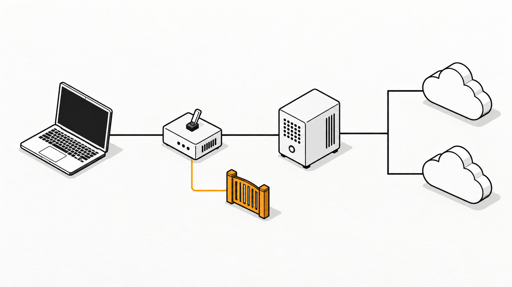

[English](README.md) | [한국어](README.ko.md)

# vmix

One Claude Code launcher for GPT and Gemini (GLM optional), driven by a single model registry and a router that refuses to answer with a model you did not pick.


`vmix` starts [Claude Code](https://github.com/anthropics/claude-code) against [claude-code-router](https://github.com/musistudio/claude-code-router) (CCR), which forwards requests to [VibeProxy](https://github.com/automazeio/vibeproxy) and optional Solgate routes. Inside one session you can switch among registered GPT, Gemini, and GLM text models with `/model`, and the conversation carries over.

This repository is also a tutorial: it lists every app you need, from a clean Mac to a working `vmix`, and the mistakes that shaped the design.

## Why this exists

It started with a question: "In my Gemini session I switched `/model` to Opus and it worked. Didn't that used to fail?"

It did not work. The UI said Opus; the replies came from GPT. The router had no route for the Claude model, so it quietly used its default model. Two problems were hiding in a setup that looked healthy:

1. **The model you see is not always the model that answers.** A router that falls back to a default turns every typo, retired model or unsupported pick into a silent substitution.
2. **The model list lived in five places** — shell functions, a launcher script, the router, the router config and the proxy. Adding one model meant editing all of them, and they drifted.

`vmix` fixes both: one registry file feeds everything, and anything not in the registry fails with a visible error.

## What you get

- `vmix`, `vmix gemini`, `vmix luna` — start a session on any registry model or alias.
- `/model` slots inside the session come from the registry (Opus = GPT-6 Sol, Sonnet = GPT-5.6 Terra, Haiku = GPT-6 Luna, custom = GPT-6 Astra). Worker slots stay on GPT, so a used-up Gemini quota cannot stall background calls; Gemini is picked from the full list. GLM rows ship disabled until you connect a Z.AI account in VibeProxy.
- `/model` lists only registry models (Claude Code's `availableModels` allowlist), and a pick made there does not become the default of your normal `claude` sessions: vmix restores the previous default when the session ends.
- A **fail-closed router**: Claude models, unknown models and disabled models return HTTP 400 instead of a default model's answer.
- `vmix sync` writes the registry into the CCR config, so the lists cannot drift.
- `vmix doctor` checks the registry, the router wiring, the proxy's model catalog and CCR health.
- `vmix smoke` sends one tiny request per model and checks **which model actually answered**.
- A thin client: the proxy can run on another always-on machine, so the laptop only runs two small Node processes.

## At a glance

| One registry feeds everything | Switch models mid-session | Refuse, never substitute |
|---|---|---|
|  |  |  |

## How it fits together



```text
 laptop (client)                                  proxy host (any always-on Mac, or the same laptop)
 ───────────────                                  ──────────────────────────────────────────────────
 vmix ──► Claude Code ──► CCR :3456 ──────────────► VibeProxy :8317 ──► ChatGPT / Gemini (your OAuth logins)
            │               │                    ▲
            │               └─ custom-router.js ─┘   reads ~/.config/vmix/models.json on every request
            └─ /model slots  ◄── ~/.config/vmix/models.json (the registry: ids, aliases, provider, context cap)
```

- The **registry** is the only file you edit. The launcher, the router and `vmix sync` all read it.
- The **router** returns `provider,model` for registry models and `vibeproxy,__vmix_unsupported__<model>` for everything else, which the proxy rejects with a 400.
- The optional [solgate](https://github.com/VoidLight00/solgate) provider adds "virtual 1M" GPT profiles by summarizing the oldest turns; enable its rows in the registry if you install it.

## What you need

| App | Runs on | What it does | Get it |
|---|---|---|---|
| macOS 13+ | proxy host | VibeProxy is a macOS app | — |
| VibeProxy | proxy host | Signs in to ChatGPT (Codex) and Gemini with OAuth and serves them on port 8317 | [Releases](https://github.com/automazeio/vibeproxy/releases) |
| ChatGPT and/or Google account | proxy host | The subscriptions VibeProxy uses | — |
| Tailscale (optional) | both machines | Private network between laptop and proxy host; skip it if both are the same machine | [tailscale.com/download](https://tailscale.com/download) |
| Node.js 20+ | laptop | Runs Claude Code, CCR and vmix | [nodejs.org](https://nodejs.org) |
| Claude Code | laptop | The coding agent UI | `npm install -g @anthropic-ai/claude-code` |
| claude-code-router 2.x | laptop | Local router on port 3456 | `npm install -g @musistudio/claude-code-router@2.0.0` |
| git, curl | laptop | Clone this repo, health checks | preinstalled on macOS |
| solgate (optional) | laptop | Virtual 1M context for GPT | [VoidLight00/solgate](https://github.com/VoidLight00/solgate) |

## Tutorial

### 1. Proxy host: install VibeProxy and sign in

1. Download VibeProxy from its [Releases](https://github.com/automazeio/vibeproxy/releases) page (Apple Silicon: `VibeProxy-arm64.zip`), move it to `/Applications` and open it.
2. Menu bar icon → **Open Settings**. The server starts automatically.
3. Click **Connect** for **Codex** (ChatGPT) and for **Gemini** or **Antigravity**, and finish the browser login.
4. Turn on **Launch at Login** so the proxy comes back after a reboot.
5. Check that it serves models:

```bash
curl -s http://127.0.0.1:8317/v1/models | head -c 400
```

The model ids you see here are the ones you can put in the registry. They change as providers ship new models; `vmix doctor` compares them for you later.

### 2. Make the proxy reachable from the laptop (skip if it is the same machine)

VibeProxy listens on all network interfaces (`lsof -nP -iTCP:8317 -sTCP:LISTEN` shows `*:8317`). That is what lets a second machine use it — and also why it should only ever be reachable on a network you trust.

1. Install Tailscale on both machines and sign in to the same tailnet.
2. On the proxy host, run `tailscale ip -4` and note the address (or use its MagicDNS name).
3. From the laptop:

```bash
curl -s -m 5 http://<proxy-host>:8317/v1/models | head -c 200
```

Never port-forward 8317 to the internet. If you are on shared Wi-Fi, enable the macOS firewall on the proxy host.

### 3. Laptop: install Node.js, Claude Code and the router

```bash
node -v                                            # must be v20 or newer
npm install -g @anthropic-ai/claude-code
npm install -g @musistudio/claude-code-router@2.0.0
claude --version && ccr -v                         # ccr must report 2.x
```

Pin claude-code-router to 2.x. Version 3 is a rewrite (desktop app and a new gateway); vmix uses the `CUSTOM_ROUTER_PATH` hook that was tested on 2.0.0, and `install.sh` stops if it finds another major version.

### 4. Install vmix

```bash
git clone https://github.com/VoidLight00/vmix.git
cd vmix
./install.sh --proxy-host <proxy-host>             # omit --proxy-host when the proxy runs on this machine
```

The installer:

- copies `vmix` and `vmix-registry.mjs` into `~/.local/bin`;
- creates `~/.config/vmix/models.json` from `config/models.example.json` — **only if it does not exist yet**;
- installs the fail-closed router as `~/.claude-code-router/custom-router.js`, backing up any previous router;
- creates or merges `~/.claude-code-router/config.json` (other providers and settings are kept, a timestamped backup is written);
- runs `vmix sync`.

If `~/.local/bin` is not on your `PATH`, the installer prints the line to add to `~/.zshrc`.

### 5. Start the router and check everything

```bash
ccr restart          # or: ccr start
vmix doctor          # registry, router wiring, proxy catalog, CCR
vmix smoke           # one tiny request per model: who actually answered?
```

`vmix smoke` sends real requests, so it uses a little of your quota. A healthy run ends with `every model answered as itself` and shows that an unregistered Claude model is refused.

### 6. Use it

```bash
vmix                 # registry default (GPT-6 Sol in the example)
vmix gemini          # Gemini 3.8 Flash
vmix gpt6 luna       # two-word aliases work too
vmix models          # ids, aliases, context caps, /model slots
vmix sol -p "explain this repo"   # anything after the model goes to Claude Code
```

Inside the session:

```text
/model               pick Opus / Sonnet / Haiku / custom — mapped to registry models
/model vibeproxy,gpt-6-luna[330k]   any registry model, typed directly
```

The part in brackets is the context size Claude Code plans around; the router strips it before the request leaves your laptop. Keep it below the model's real limit so auto-compaction runs before the provider rejects a long conversation.

### 7. Optional: virtual 1M context with solgate

Install [solgate](https://github.com/VoidLight00/solgate) (its installer adds a `solgate` provider to the CCR config), then set `"enabled": true` on the `*-1m` rows in your registry and run `vmix sync && ccr restart && vmix smoke sol1m`. Old turns are summarized once a conversation passes roughly 300k tokens; it is a rolling summary, not a larger model window.

## Adding or removing a model

Edit one row in `~/.config/vmix/models.json`, then:

```bash
vmix sync && ccr restart
vmix doctor && vmix smoke <new-id>
```

| Field | Meaning |
|---|---|
| `id` | Exact model id from the proxy's `/v1/models` |
| `aliases` | Short names for `vmix <alias>`; spaces and case are ignored (`gpt6 luna` = `gpt6luna`) |
| `provider` | Name of the CCR provider that serves it (`vibeproxy`, `solgate`, …) |
| `contextCap` | Context size Claude Code should plan around, e.g. `330k`, `700k`, `1m` |
| `enabled` | `false` keeps the row but makes the router refuse it |
| `picker` | Optional `/model` slot: `opus`, `sonnet`, `haiku` or `custom` (each at most once) |
| `label` | Name shown in `/model` |

The router re-reads the registry on every request, so enabling or disabling a model takes effect immediately; `vmix sync` and `ccr restart` keep the CCR provider lists in step.

## Troubleshooting

| Symptom | Likely cause | Fix |
|---|---|---|
| `claude-code-router is not answering` | CCR stopped | `ccr start`, then `vmix doctor` |
| Requests hang, then time out; `doctor` says it cannot read the model list | Proxy host unreachable — VPN off after a reboot, machine asleep, VibeProxy stopped | Turn Tailscale on, wake the proxy host, check VibeProxy is running |
| `__vmix_unsupported__<model>` 400 | You picked a model that is not an enabled registry row (for example a Claude model) | Working as intended. Pick a registry model, or add the row |
| `not offered upstream: <id>` | The provider renamed or retired the model, or the account is logged out | Update the id from `/v1/models`, or reconnect the account in VibeProxy |
| `smoke` fails with a quota or balance message | That model's usage window or balance is exhausted | Wait or recharge, then retry; vmix never silently substitutes another model |
| `vmix` still behaves like an old script | A shell function or alias named `vmix` shadows the binary | `type vmix` should print a path in `~/.local/bin` |
| Plain `claude` starts on `haiku` or a proxy model | A proxy session that was not started by vmix saved its `/model` pick as the global default | Pick your usual model with `/model` in a normal `claude` session, and start proxy sessions with `vmix` |

## Lessons learned

These are the failures that shaped the design, in the order we hit them.

1. **Silent fallback.** A router that returns "no decision" for an unknown model lets CCR use `Router.default`. The session keeps working, on the wrong model.
2. **Not every way of saying "no" is a refusal.** We ran a throwaway CCR and measured each option for an unregistered model: returning `null` → answered by `Router.default`; throwing an error → also answered by `Router.default`; returning a provider that does not exist → 404 from CCR; returning a real provider with an invalid model id → 400 from the proxy. vmix uses the last one, so the refusal is an ordinary upstream error rather than a CCR internal.
3. **The context label must never reach the provider.** `gpt-6-sol[330k]` is for Claude Code; sent upstream it becomes an unknown model. The router strips it.
4. **Background calls use the Haiku slot.** Once the router refuses Claude models, a session that leaves the Haiku slot on a Claude model starts failing its background calls. `vmix` always pins Haiku (and `ANTHROPIC_SMALL_FAST_MODEL`) to a registry model.
5. **Shell functions win over binaries.** A leftover function with the same name keeps running old code after you install a new launcher.
6. **Reboots turn VPNs off.** After a restart, every request timed out because Tailscale was stopped. `vmix doctor` names this case explicitly.
7. **`/model` in a proxy session rewrites your global default.** Claude Code saves the pick in `~/.claude/settings.json`, so the next plain `claude` started on `haiku` or on a proxy route it cannot reach. It happened repeatedly before we noticed. vmix now records the default before a session and restores it afterwards; a native `claude-…` model picked meanwhile is kept.
8. **Worker slots share a quota with whatever they point at.** With the Sonnet slot on Gemini, a GPT session failed as soon as the Gemini quota ran out, because background work used that slot. All worker slots now point at GPT models.

## Keeping the laptop light

The heavy parts — OAuth sessions, token refresh, provider connections — run on the proxy host. On the author's laptop, the router measured about 22 MB of resident memory and the optional solgate about 23 MB, both near 0% CPU when idle. If you have an always-on Mac (a Mac mini works well), run VibeProxy there and point every laptop at it with `--proxy-host`.

## Security and terms

- Keep port 8317 on a private network. In the author's setup it answered requests that carried no API key at all, so anyone who can reach it can use your subscriptions.
- CCR listens on `127.0.0.1` by default; keep it that way.
- `vmix` unsets `ANTHROPIC_API_KEY` before starting Claude Code, so a real Anthropic key never goes to the local router.
- Using subscriptions through a proxy is subject to each provider's terms. Read them before you rely on this setup.
- This project is not affiliated with Anthropic, OpenAI, Google, VibeProxy or claude-code-router, and has no relation to the vMix video software.

## Development

```bash
node --test tests/*.test.mjs        # offline tests: registry, router, launcher, installer, error paths
bash gates/verify_vmix.sh .         # every gate; exit 0 means ready to publish
```

The tests start fake upstreams, a fake CCR and a fake `claude`, so they need no proxy and no network.

## License

[MIT](LICENSE)
